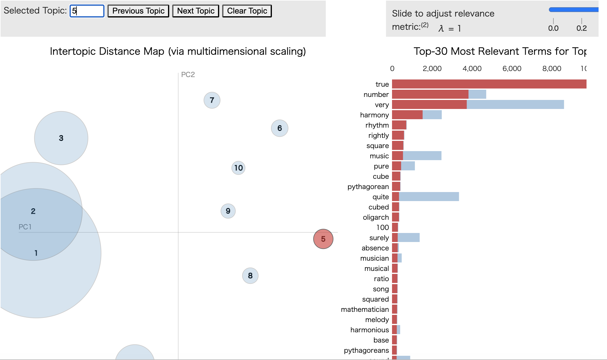

# topic_modeling.ipynb

## Description and commands to execute under the assumption that homebrew has been installed.
- Steps to create a environment
```bash
conda create --name myenv python=3.10
```
- Activate Virtual Environment
```
conda activate myenv
```
- Install JupyterLab
```
conda install jupyterlab
```
- Activate Jupiter Labs
```
jupyter lab
```
---
# Packages to install
```
conda install numpy scipy scikit-learn matplotlib h5py pillow tensorflow -y
```
---
# List of packages to install with pip
```
pip install pyLDAvis
```
```
pip install nltk
```
